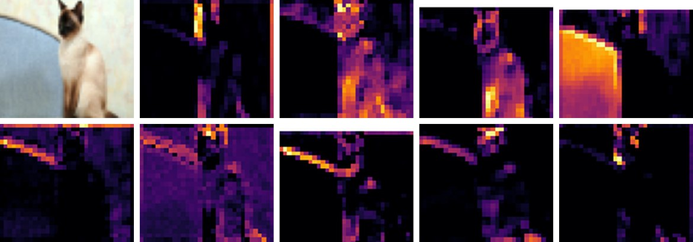

# Clasificación de imágenes con redes convolucionales

Estudio controlado de decisiones de diseño en una CNN (GoalNet) sobre CIFAR-10: hiperparámetros, inicialización, normalización (BatchNorm, GroupNorm, LayerNorm), ensembles, data augmentation y mixup, y linear probing en CIFAR-10 e ImageNet64.

**Resultado:** un ensemble de tres redes alcanza un **84.9 %** de precisión, 4.5 puntos por encima de la media de las redes individuales.

Trabajo en equipo de cinco personas · TSBB19 Machine Learning for Computer Vision, Linköping University · 2026



## Archivos

| Archivo | Contenido |
|---|---|
| `main.py` | Carga de datos, entrenamiento de tres redes, ensemble y visualización de activaciones |
| `train.py`, `test.py` | Bucle de entrenamiento y evaluación |
| `report.pdf` | Informe completo (en inglés) |

## Cómo ejecutarlo

1. Instala las dependencias:
   ```bash
   pip install torch torchvision numpy matplotlib
   ```
2. El código importa la arquitectura desde `models/goalNet.py` y `models/cvlNet.py`, que no están en esta carpeta; hay que añadirlas.
3. En `main.py`, cambia la ruta `root='/courses/TSBB19'` (servidor del curso) por una carpeta local, por ejemplo `root='./data'`. CIFAR-10 se descarga solo.
4. Ejecuta:
   ```bash
   python main.py --dataset cifar10
   ```
