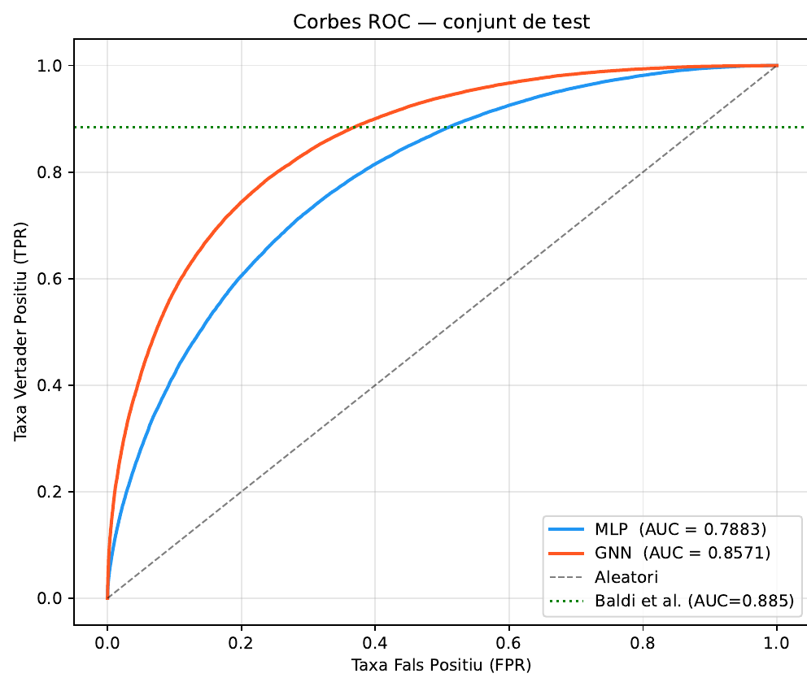

# Detección del bosón de Higgs con redes de grafos

Clasificación de colisiones protón–protón (señal de Higgs frente a fondo) con el dataset HIGGS. Cada evento se representa como un grafo de partículas y se clasifica con una GNN (EdgeConv), que se compara con un perceptrón multicapa (MLP).

**Resultado:** AUC-ROC en test de **0.857** con la GNN frente a 0.788 con el MLP.

Proyecto individual · Aprendizaje Automático II, Grado en Estadística Aplicada (UAB) · 2026



## Archivos

| Archivo | Contenido |
|---|---|
| `Codi.ipynb` | Notebook con todo el proceso: carga, preprocesado, MLP, GNN y evaluación |
| `informe.pdf` | Informe completo (en catalán) |
| `figura.png` | Curvas ROC de los dos modelos |

## Cómo ejecutarlo

1. Descarga el [HIGGS dataset](https://www.kaggle.com/datasets/erikbiswas/higgs-uci-dataset) y guarda `HIGGS.csv` en esta carpeta.
2. Instala las dependencias:
   ```bash
   pip install torch torch_geometric scikit-learn pandas numpy scipy matplotlib seaborn
   ```
3. Abre `Codi.ipynb` en Jupyter o Google Colab y ejecuta las celdas en orden. Con GPU el entrenamiento es mucho más rápido.

El número de filas que se leen se controla con `N_SAMPLES` al principio del notebook; redúcelo para hacer pruebas rápidas.
