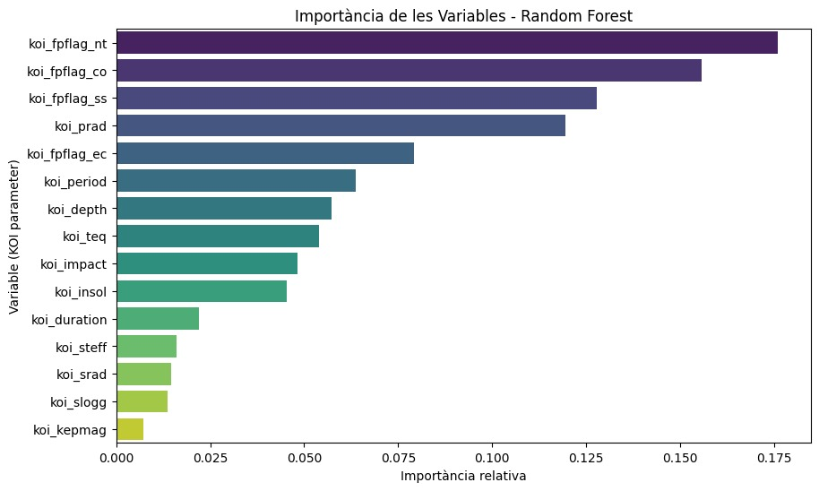

# Detección de exoplanetas con datos del telescopio Kepler

Clasificación de señales del telescopio Kepler de la NASA en exoplanetas confirmados o falsos positivos. Se comparan k-NN, SVM (kernel lineal y RBF) y Random Forest con búsqueda de hiperparámetros, validación cruzada de 10 folds y tests pareados.

**Resultado:** el Random Forest final alcanza un AUC de **0.999** y un 98.7 % de precisión en test; su importancia de variables coincide con los criterios astrofísicos de la NASA.

Pol Ortiz, Rubén Soria y Pau Verdejo · Aprendizaje Automático, Grado en Estadística Aplicada (UAB) · 2025



## Archivos

| Archivo | Contenido |
|---|---|
| `exoplanetes.ipynb` | Código del anexo del informe: exploración, k-NN, SVM, Random Forest y comparación estadística |
| `informe.pdf` | Informe completo (en catalán) |

## Cómo ejecutarlo

1. Descarga el dataset [Kepler Exoplanet Search Results](https://www.kaggle.com/datasets/nasa/kepler-exoplanet-search-results) y guarda `cumulative.csv` en esta carpeta.
2. Instala las dependencias:
   ```bash
   pip install pandas numpy scipy scikit-learn matplotlib seaborn
   ```
3. Abre `exoplanetes.ipynb` en Jupyter o Google Colab y ejecuta las celdas en orden.
