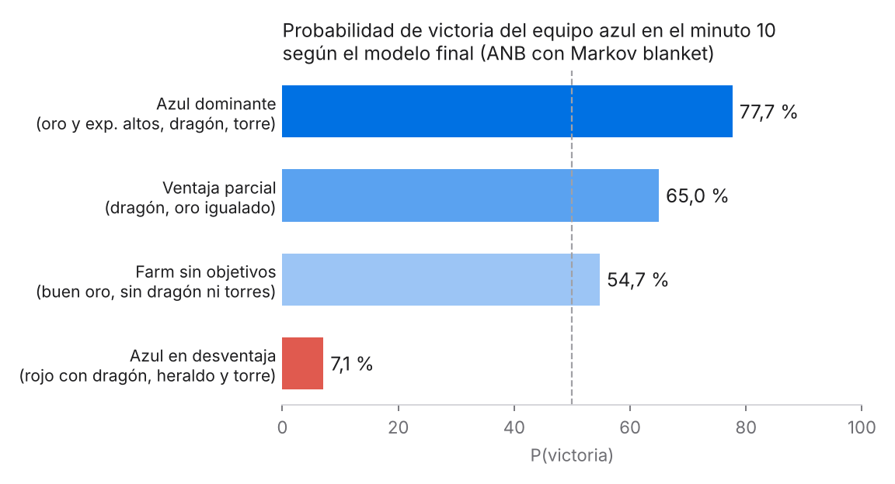

# Predicción de victoria en League of Legends con redes bayesianas

Clasificadores bayesianos que estiman la probabilidad de que gane el equipo azul a partir del estado de la partida en el minuto 10. Se comparan Naive Bayes y Augmented Naive Bayes, con y sin selección de variables por Markov blanket, mediante validación cruzada de 10 folds y tests pareados con corrección de Holm.

**Resultado:** el modelo final (ANB con Markov blanket) es el mejor calibrado (Brier 0.189) con solo 10 variables y un AUC de 0.794.

Pol Ortiz y Pau Verdejo · Modelización de Datos Complejos, Grado en Estadística Aplicada (UAB) · 2026



## Archivos

| Archivo | Contenido |
|---|---|
| `script.R` | Código completo: limpieza, discretización, modelos, validación, tests y escenarios |
| `ranked_10min.csv` | Datos: 9.879 partidas de rango alto con estadísticas al minuto 10 |
| `doc_DataBase.pdf` | Descripción de la base de datos y sus variables (en catalán) |
| `informe.pdf` | Informe completo (en catalán) |

## Cómo ejecutarlo

1. Instala los paquetes en R:
   ```r
   install.packages("BiocManager")
   BiocManager::install(c("graph", "RBGL"))   # dependencias de gRain
   install.packages(c("bnlearn", "gRain", "ggplot2", "pROC", "tidyr"))
   ```
2. Abre `script.R` en RStudio con esta carpeta como directorio de trabajo (`setwd()` o un proyecto de RStudio) y ejecútalo de principio a fin.
