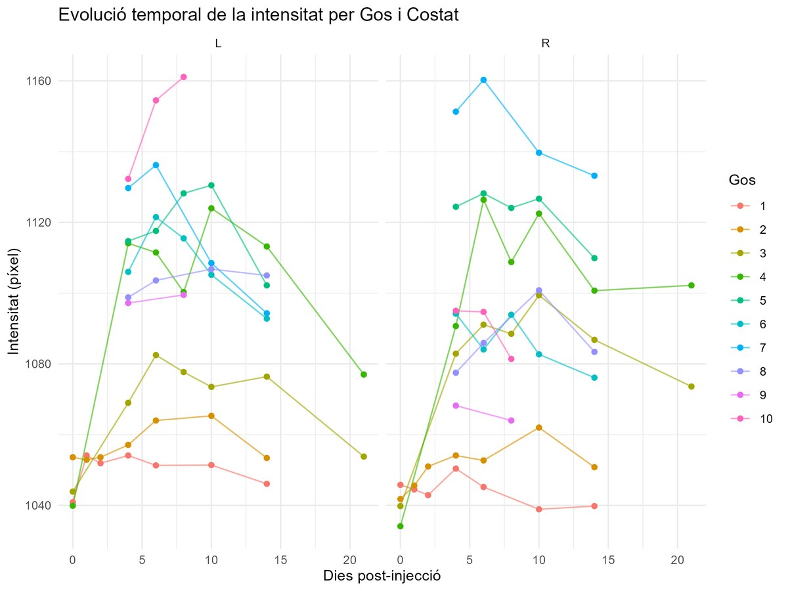

# Evolución de un contraste radiológico con modelos lineales mixtos

Análisis longitudinal de la intensidad de píxel en imágenes de diez perros tras inyectar un agente de contraste. Se ajusta un modelo lineal mixto con intercepto aleatorio por perro y tendencia cuadrática en el tiempo, seleccionado con AIC y tests de razón de verosimilitudes, con diagnóstico completo (normalidad, homocedasticidad, autocorrelación AR(1) y distancia de Cook).

**Resultado:** la intensidad máxima se alcanza hacia el **día 10** tras la inyección; el modelo explica el 73 % de la variabilidad (R² condicional) y la correlación intraclase entre perros es de 0.71.

Carlos Torras, Pau Verdejo, Paulina Toro y Pol Ortiz · Modelos Lineales II, Grado en Estadística Aplicada (UAB) · 2025



## Archivos

| Archivo | Contenido |
|---|---|
| `analisi_pixel.R` | Código del anexo del informe: descriptiva, modelos, diagnóstico e influencia |
| `informe.pdf` | Informe completo (en catalán) |

## Cómo ejecutarlo

1. Instala los paquetes en R:
   ```r
   install.packages(c("lme4", "lmerTest", "MuMIn", "lmtest", "car", "influence.ME", "nlme", "ggplot2", "gridExtra"))
   ```
2. Los datos son el dataset `Pixel` del paquete `nlme`. En `analisi_pixel.R`, sustituye la línea `read.csv("Pixel.csv")` por la que está comentada justo debajo (`as.data.frame(nlme::Pixel)`), o guarda los datos como `Pixel.csv` en esta carpeta.
3. Ejecuta el script en RStudio de principio a fin.
